AUTO
========
Auto 是一种在 Excel 文件中自动填充数据的工具。它可以根据鼠标光标的位置自动填充数据，还支持手动输入数据。
> <b>如果您有任何问题，请与我联系. 
> Author: [HePing](https://github.com/UF4OVER) `点击查看更多信息`.  
> Contact Me: [WeChat](https://github.com/UF4OVER/auto_excal/blob/master/docs/img_1.png) `点击链接来添加我的联系方式.` 

## 更新日志:

### 更新: 2024 年 11 月 9 日，该软件为最新版本，版本号为“2.4.5”. 
  - 添加了自选数据插入，用户可以插入表中连续的任意一段数据来单独填入表格。
  - 表格可以直接拖入而不用重复输入。
  - 支持数据一行一行的删除
  - 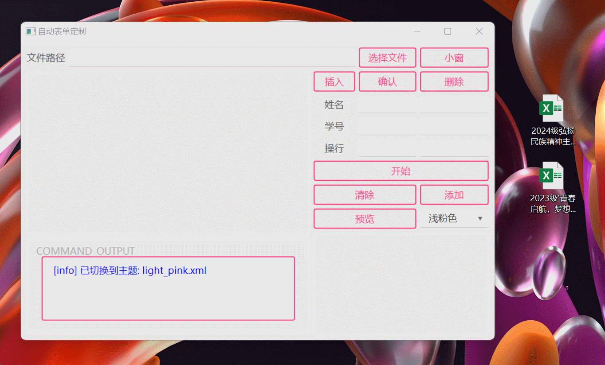
  - 
### 更新: 2024 年 11 月 8 日，该软件为最新版本，版本号为“2.4.0”. 
  - 更新了鼠标移动事件，修改后的源码如下:
  - 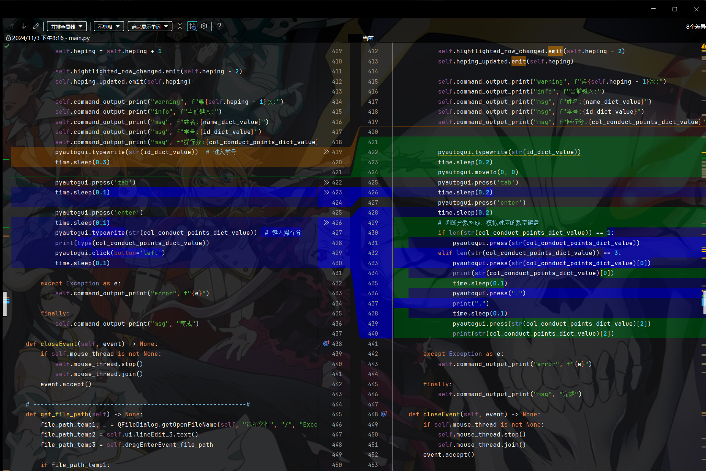

## The First: Usage
- 运行应用程序.
    - Windows: 双击 `main.exe`
    - macOS:目前不可用
  - 您可以看到以下窗口:
  -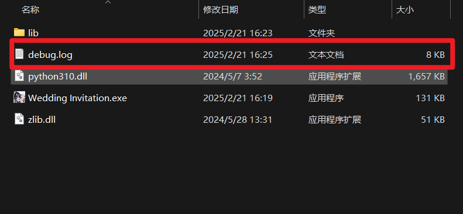
  - 然后选择要填写数据的 Excel 文件。
  -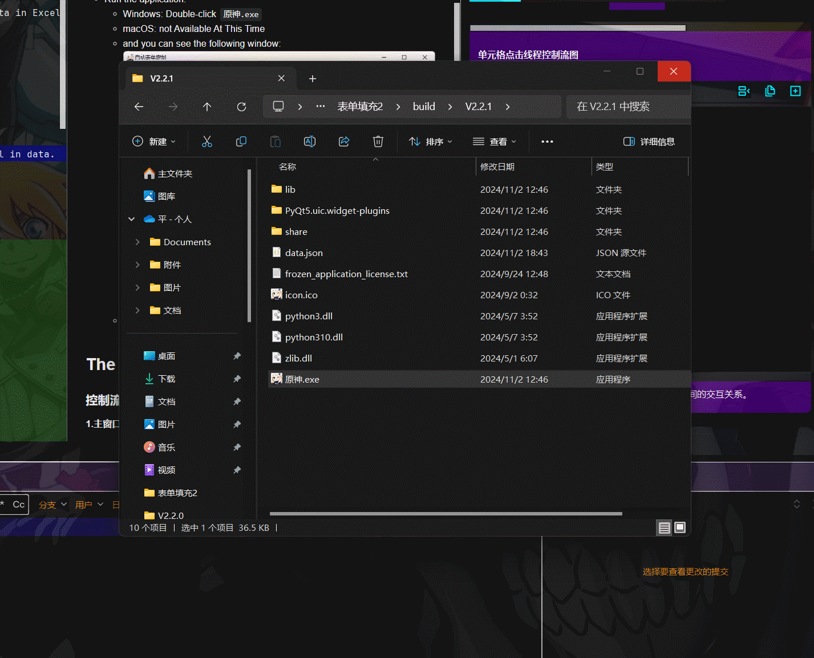
  - 如果要添加数据，可以单击 `添加` 按钮，当然，您也可以添加作者信息 hhhhhh....
  - 然后，您可以点击 `开始` 按钮开始监控.:
  - 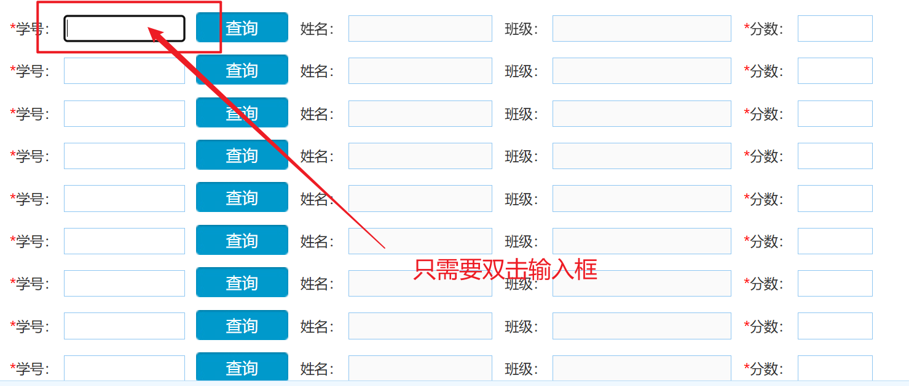
  - 然后你可以看到以下窗口:
  - 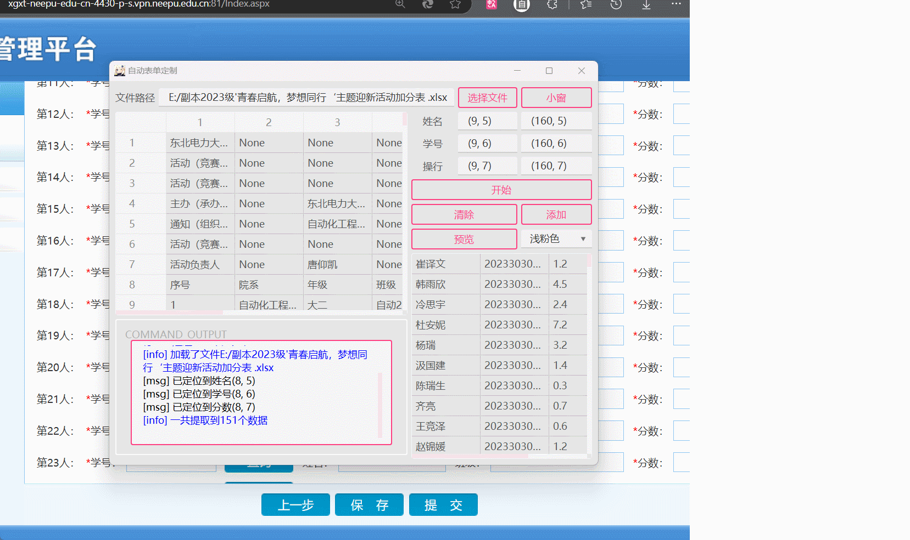
  - >注意：上图中的操作其实可以直接查询 name
  - 打开需要输入数据的网站，然后点击鼠标左键，如果检测到双击，则会自动填充数据，
  - 如果要创建新表格，可以点击“结束”按钮，此按钮只会暂停双击线程，不会停止整个程序。
- Theme：
  - 您可以通过单击以下按钮来更改应用程序的主题。
  - 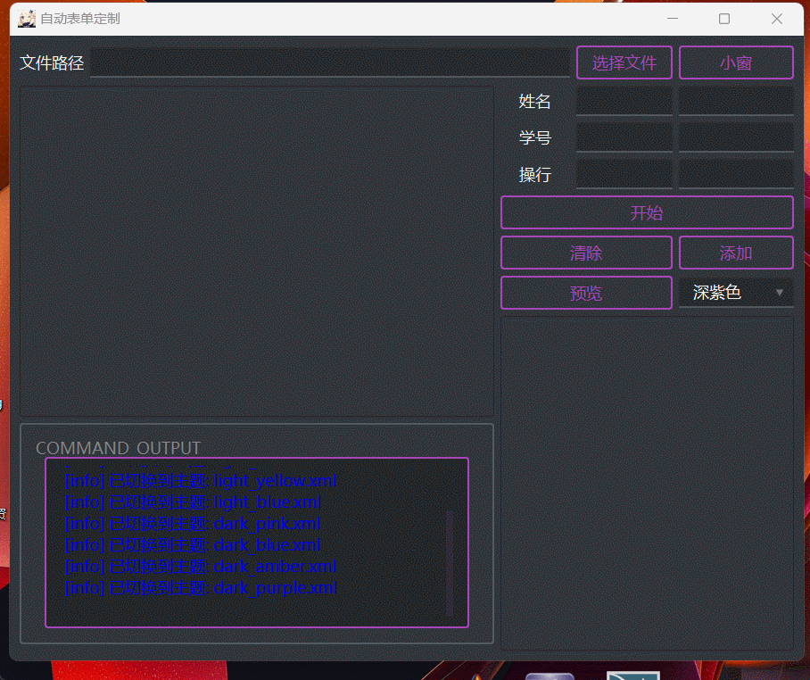
- small window:
  - 您可以点击 `小窗`按钮打开一个小窗口，小窗口将显示在另一个窗口<b>的顶部</b>。  
  - 

## The End

### 控制流图
#### 1.主窗口控制流图
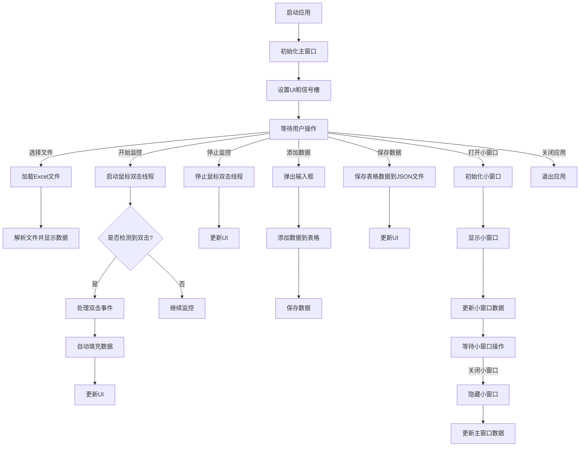

#### 2.小窗口控制流图

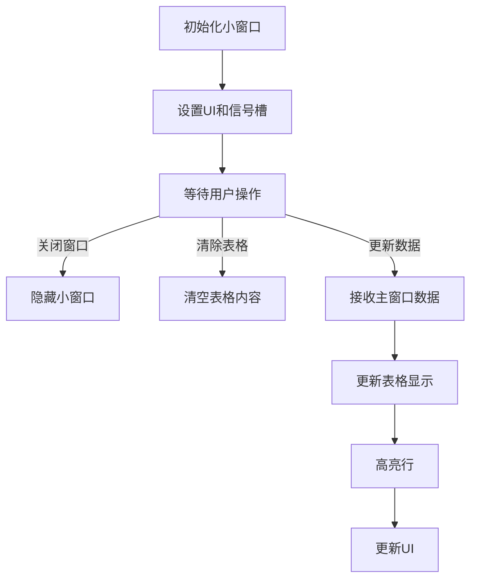

#### 3.鼠标双击监控线程控制流图
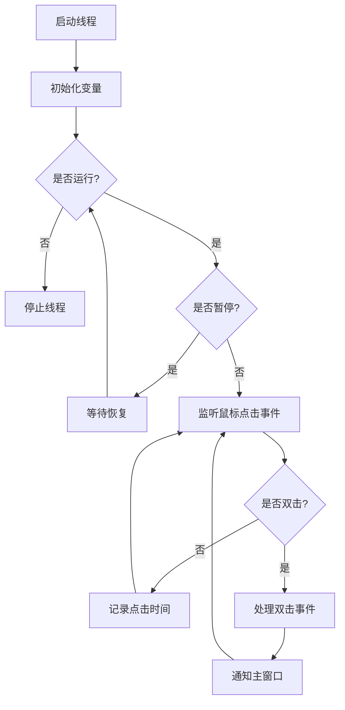

#### 4.单元格点击线程控制流图
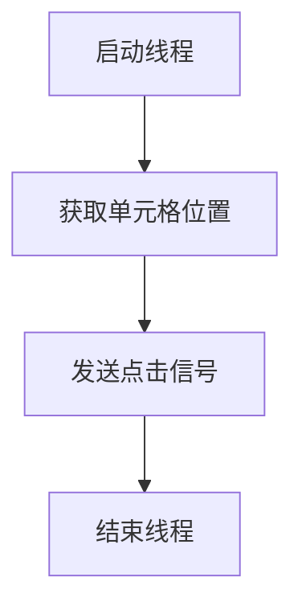

