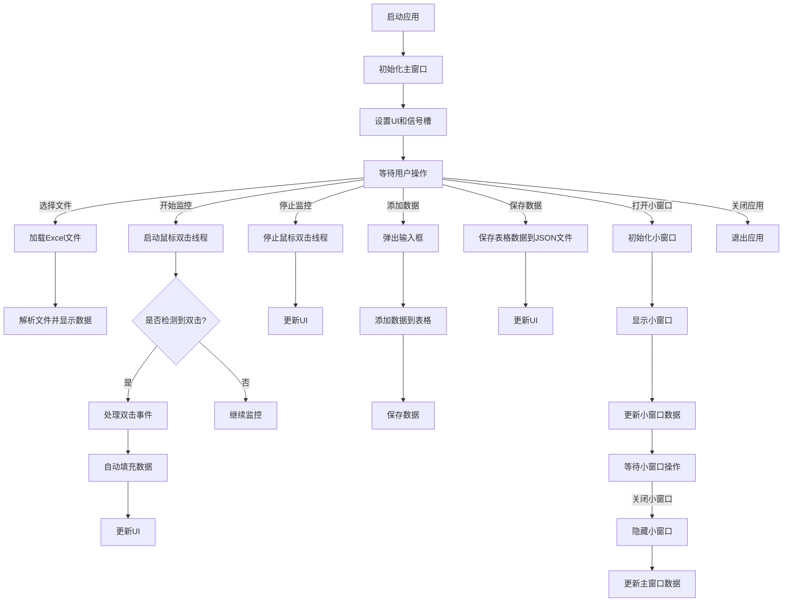
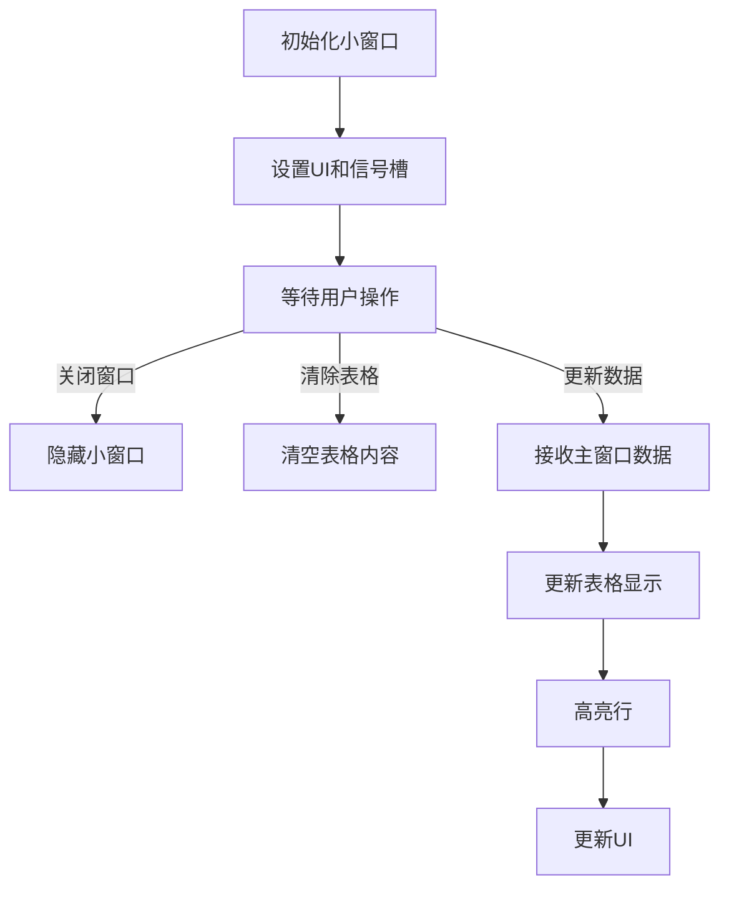
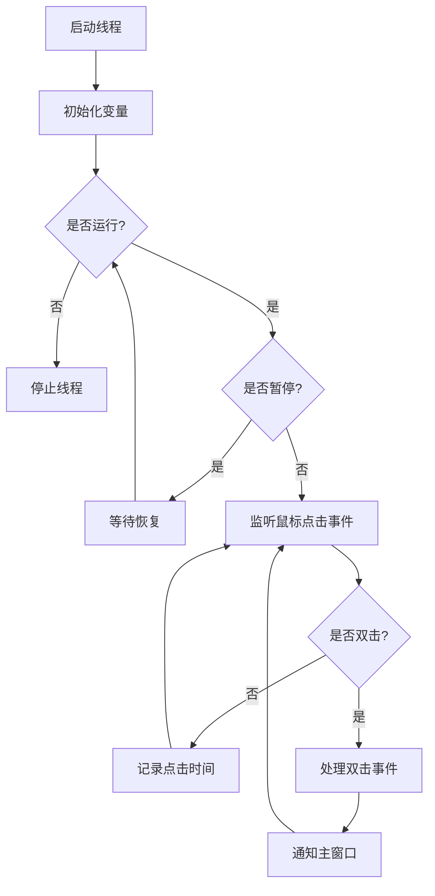
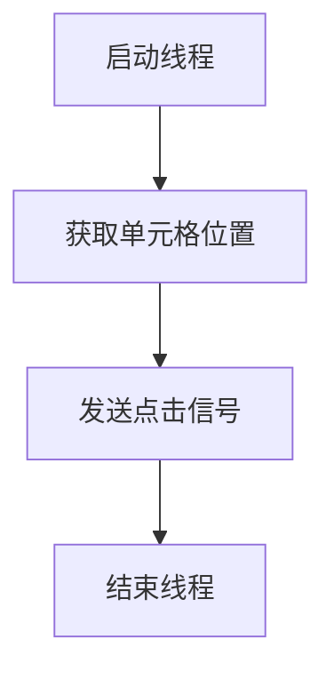

AUTO
========
Auto is a tool for automatically filling in data in Excel files. It can automatically fill in data based on the position of the mouse cursor, and also supports manual input of data. It can also automatically save data to a JSON file.

> <b>if you have any questions, please contact me. 
> Author: [HePing](https://github.com/UF4OVER) `click green to see more information`.  
> Contact Me: [WeChat](https://github.com/UF4OVER/auto_excal/blob/master/docs/img_1.png) `cilck the green to add me.` 

> notice: As of 2024-11-08, the software is the latest version with version number '2.4.0'. 
- Updated the mouse movement event, and the modified source code is as follows:
  
## The First: Usage
- Run the application.
    - Windows: Double-click `原神.exe`
    - macOS: not Available At This Time
  - and you can see the following window:
  -
  - then select the Excel file you want to fill in data.
  -
  - if you want to add data, you can click the `添加` button，of course, you can also add author information hhhhhh....
  - then you can push the `开始` button to start monitoring.:
  - 
  - then you can see the following window:
  - 
  - >Note: The operation in the above figure can actually directly query the name
  - open the website you need to input data, then click the left mouse button, if a double click is detected, then the data will be automatically populated, and the data will be automatically saved to a JSON file.
  - if you want to creat a new table, you can click the `结束` button，this button will only pause the double-click thread and will not stop the entire program.
- Theme：
  - you can change the theme of the application by clicking the following button.
  - 
- small window:
  - you can click the `小窗` button to open a small window and the small window will be displayed on the <b>TOP</b> of the other window.
  - 

## The End

### 控制流图
#### 1.主窗口控制流图

#### 2.小窗口控制流图

#### 3.鼠标双击监控线程控制流图

#### 4.单元格点击线程控制流图

