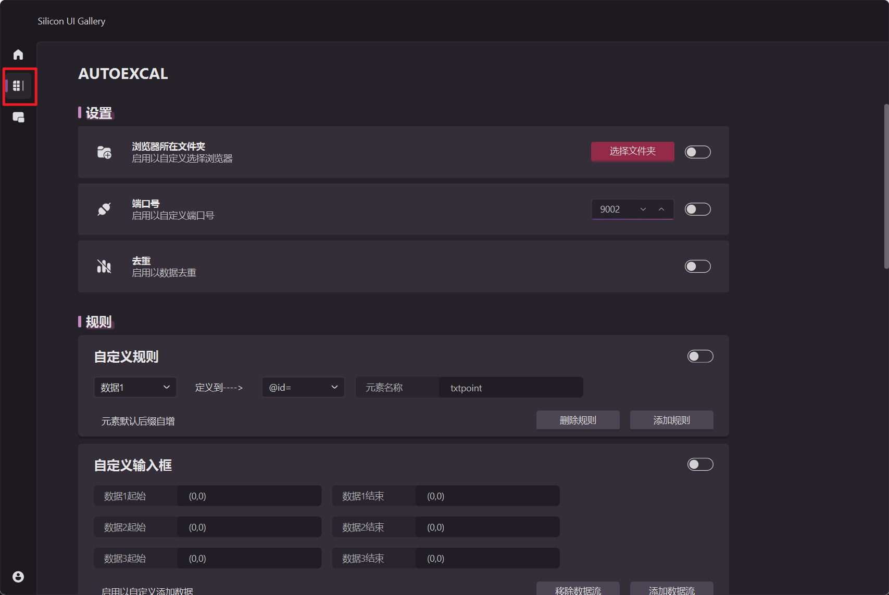

# AUTOEXCAL
## 1.主界面
### 1.1 主界面
- 可以添加浏览器路径（不添加为默认浏览器）
- 端口号（一般基本上开放所有端口）
- 去重模式（自动删除重复数据）
### 1.2 添加规则
  - 添加规则
    >   说明：就是将数据流添加到对应的网页元素中，可以自定义匹配元素名称和类型，一般的很多元素都是重复的的名称只是后缀一般都是自增的，比如以下代码中：这是是一个输入框，其中`id="txtstu1`,但是界面上有多个同类型的输入框，所以需要设置匹配规则，这样当有数据流发送过来时，就会匹配到这个元素，
    ```python
    
    # @是单属性匹配符，=是精确匹配，id为匹配属性，txtstu为匹配值，自增为匹配后缀
    ele = tab1.ele(f'@id=txtstu{自增}')
    ele.input(f"{要填入的内容}")
    ```
    > 然后将数据流发送到这个元素中，这样数据就会自动填充到输入框中。
    ```html
    <input class="input20" style="width: 100px;" type="text" id="txtstu1" name="txtstu1">
    <input class="input20" style="width: 100px;" type="text" id="txtstu2" name="txtstu1">
    <input class="input20" style="width: 100px;" type="text" id="txtstu3" name="txtstu1">
    <input class="input20" style="width: 100px;" type="text" id="txtstu4" name="txtstu1">
    <input class="input20" style="width: 100px;" type="text" id="txtstu5" name="txtstu1">
    .....
    ```
    > 这样就可以完成数据的自动填充了。
### 1.3 添加输入框
- 从表格中添加需要输入的数据
### 1.4 添加按钮





